# WallpaperEM

**壁纸引擎魔法 · Wallpaper Engine Magic**

[](LICENSE)
[](CHANGELOG.md)
[](#平台说明--platform-notes)
[](https://tauri.app/)
[](https://github.com/oneincase/webwallgl)

<p align="center">
  
</p>

**WallpaperEM** 是一款极致优雅的全平台桌面壁纸引擎软件，绝非 WE 的简单复刻！**场景、网页、视频、图片全支持！** 浏览并下载 Steam 创意工坊（Wallpaper Engine）壁纸，一键应用到桌面，支持多显示器、托盘与全局快捷键。

它的优点：**极小的安装包大小 · 第三方依赖解耦 · 极好的性能优化 · 多档位画质预设 · AI 壁纸创作 · 壁纸分享（链接支持手机打开实时渲染）** —— 后续版本还有更多优秀的功能等待大家体验！！！

**WallpaperEM** is a supremely elegant, cross-platform desktop wallpaper engine — definitely **not a simple clone of Wallpaper Engine**! **Scenes, web pages, videos and images — all supported!** Browse and download Wallpaper Engine Workshop wallpapers and apply them to your desktop in one click, with multi-display, a tray icon and global shortcuts.

Its highlights: **tiny installer size · decoupled third-party dependencies · excellent performance optimisation · multi-level quality presets · AI wallpaper creation · wallpaper sharing (open the link on your phone for live real-time rendering)** — and many more great features waiting for you in future versions!!!

---

## ✨ 动态效果预览 / Live Previews

<p align="center">
  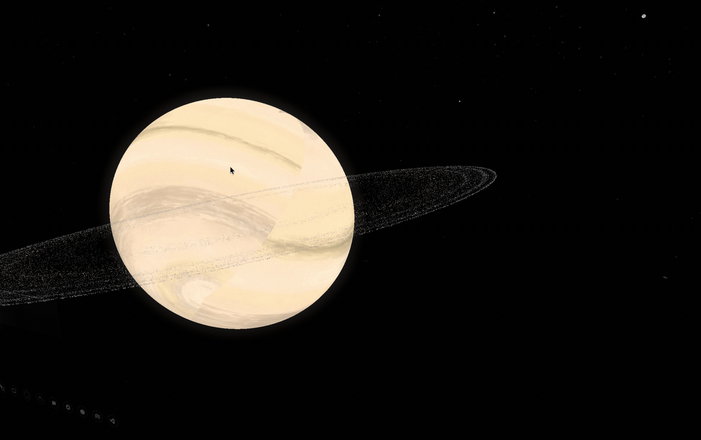
  &nbsp;&nbsp;
  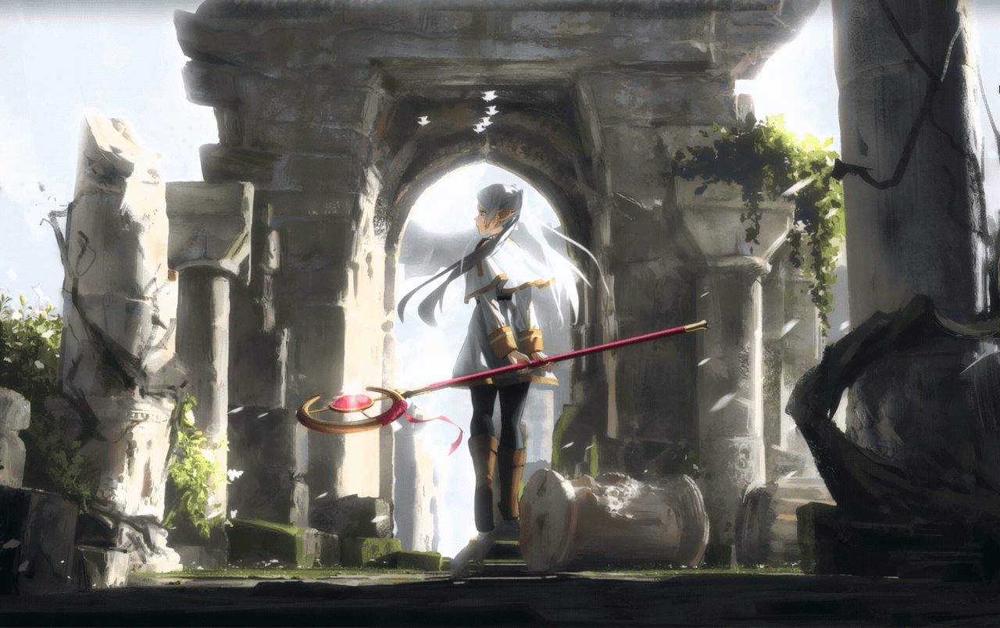<br/>
  <sub>科幻 3D 场景 · HDR 实时渲染 — Sci-fi 3D scene &nbsp;·&nbsp; 动漫场景 · 花瓣动效 — Anime scene</sub>
</p>

<p align="center">
  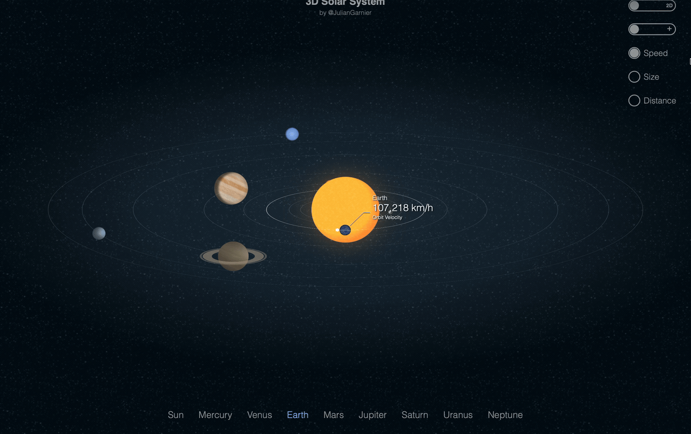
  &nbsp;&nbsp;
  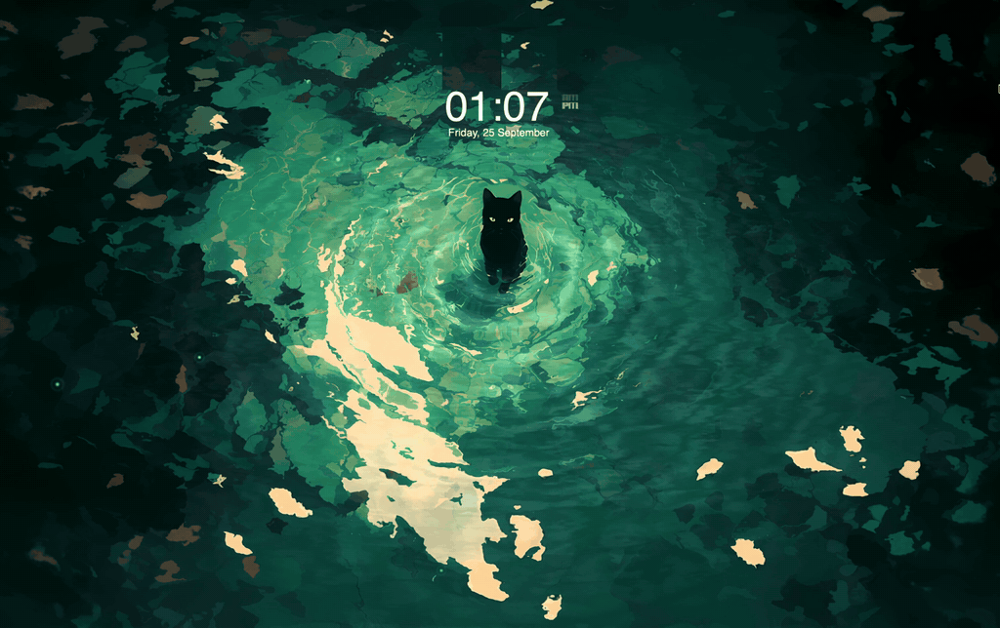<br/>
  <sub><b>Web 壁纸</b> · 3D 太阳系 — Web wallpaper &nbsp;·&nbsp; 音频可视化 · 治愈系 — Audio visualizer</sub>
</p>

<p align="center">
  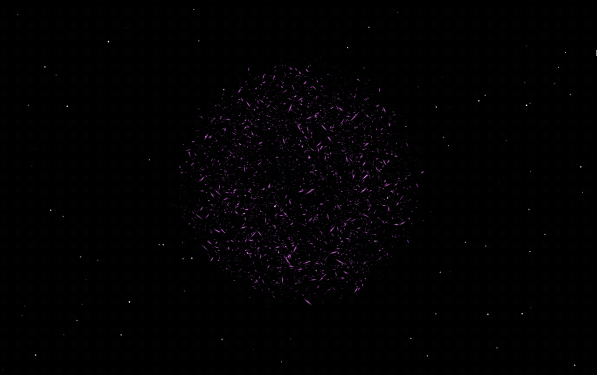
  &nbsp;&nbsp;
  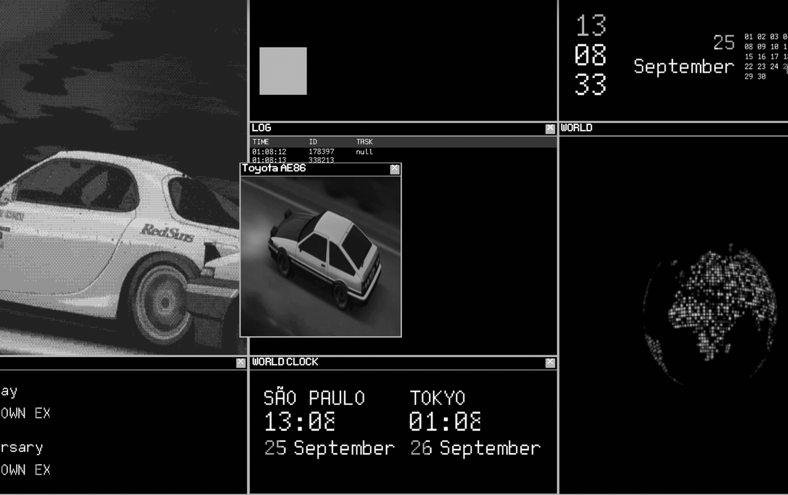<br/>
  <sub>像素粒子 · 音频互动 — Audio-reactive particles &nbsp;·&nbsp; 复古载具 · 系统面板风 — Retro vehicle</sub>
</p>

<p align="center">
  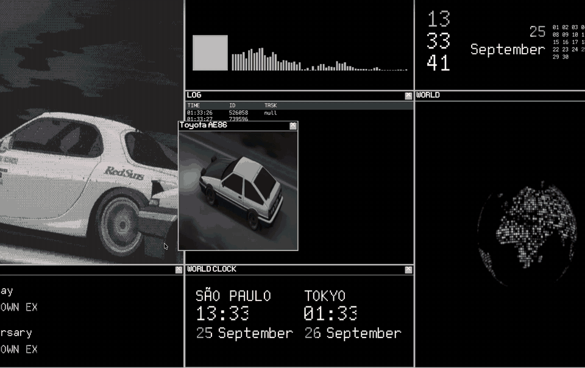<br/>
  <sub><b>无缝切换</b>功能演示 · 16 秒连切 4 张 — Seamless switching demo</sub>
</p>

<p align="center"><sub>以上画面为 macOS 真机实拍；示例壁纸来自 Steam 创意工坊第三方作者作品，仅作渲染效果演示。</sub></p>
<p align="center"><sub>Captured live on macOS; sample wallpapers are third-party Workshop works shown for rendering demo only.</sub></p>

---

## 🖼️ 界面截图 / Screenshots

<p align="center">
  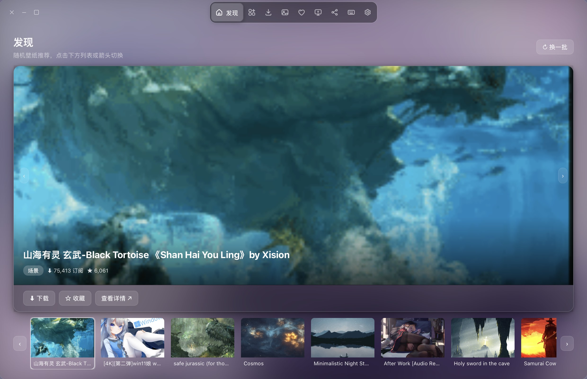
</p>
<p align="center"><sub>发现 · 随机推荐，点缩略图或箭头换一批 — Discover: random Workshop picks</sub></p>

<p align="center">
  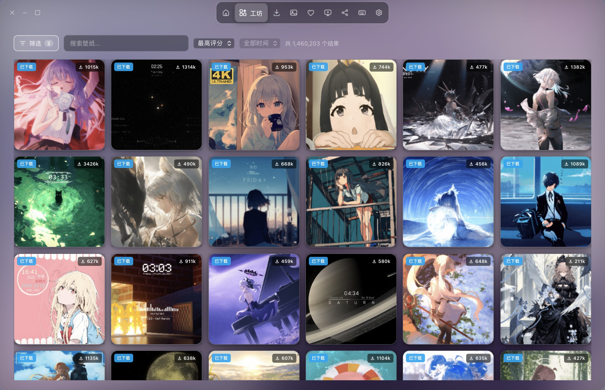
</p>
<p align="center"><sub>工坊 · 搜索 / 排序 / 筛选，一键下载（已入库的条目带「已下载」标记）— Browse the Steam Workshop</sub></p>

<p align="center">
  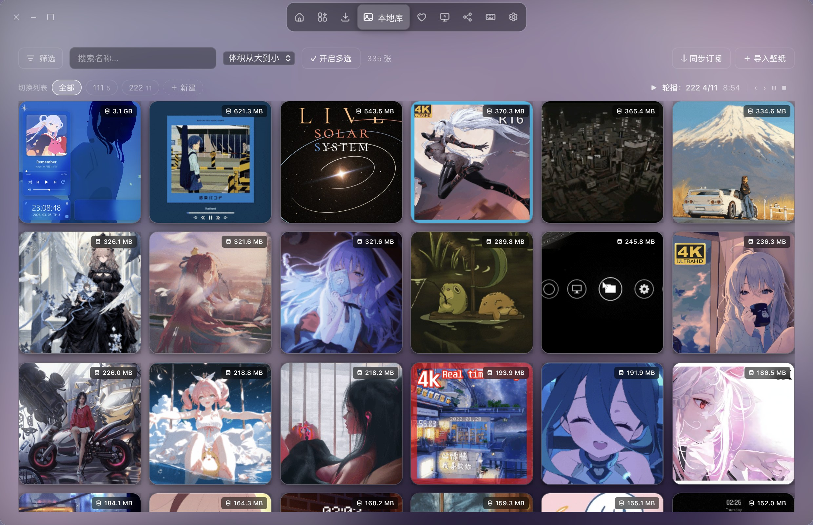
</p>
<p align="center"><sub>本地库 · 筛选 / 搜索 / 切换列表（轮播进度与控制在右上角）— Local library: filter, search, playlists</sub></p>

<p align="center">
  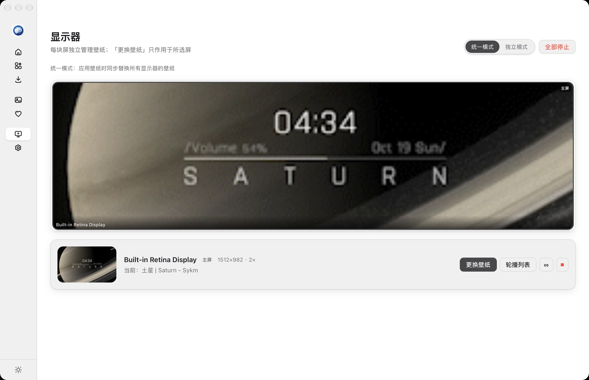
</p>
<p align="center"><sub>显示器 · 每屏独立管理（统一 / 独立模式 · 每屏轮播）— Displays: per-screen control &amp; rotation</sub></p>

<p align="center">
  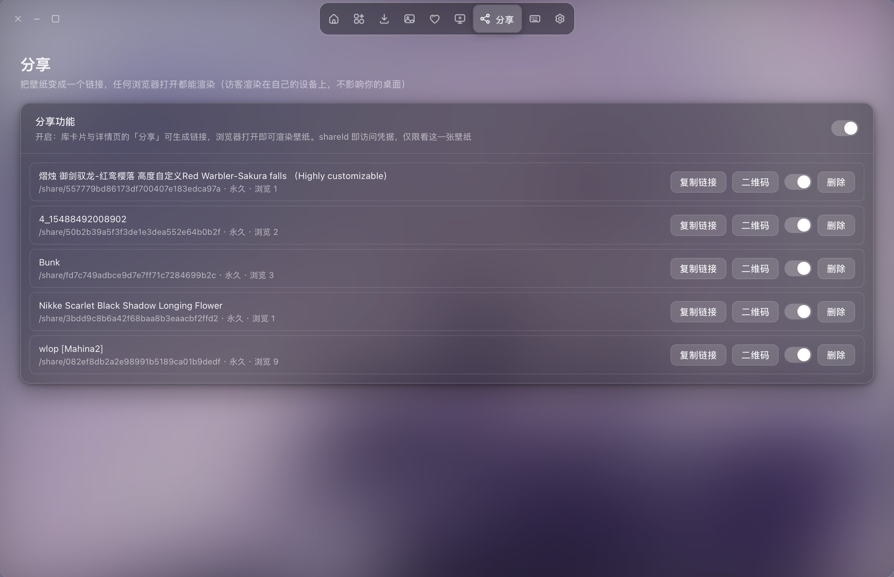
</p>
<p align="center"><sub>分享 · 一条链接手机实时渲染（二维码 / 启停 / 浏览数）— Shares: live rendering on your phone</sub></p>

<p align="center">
  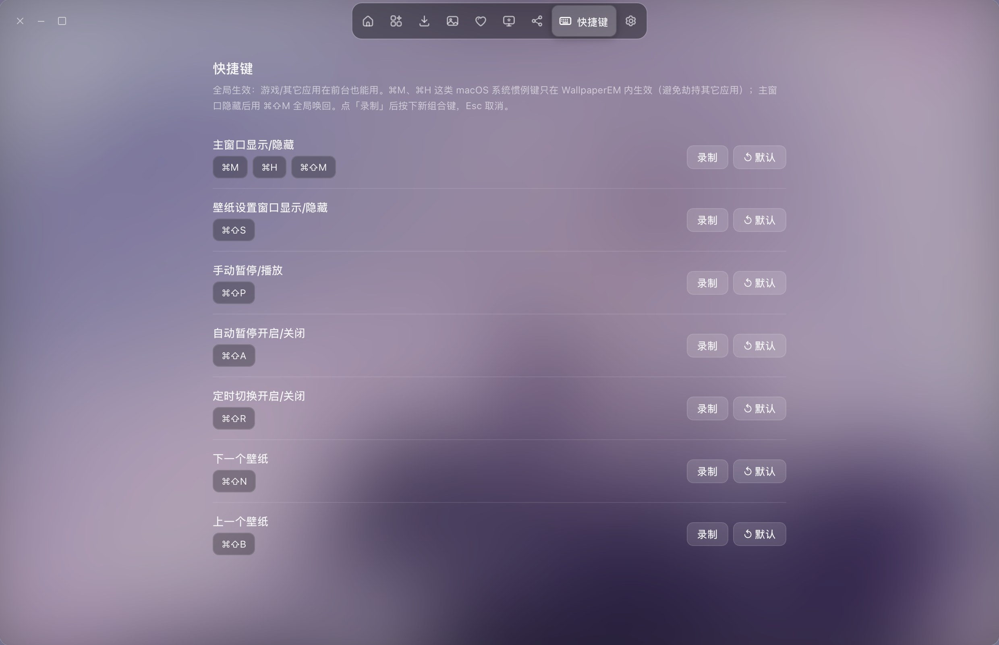
</p>
<p align="center"><sub>快捷键 · 全局热键逐项自定义录制 — Global hotkeys, individually rebindable</sub></p>

<p align="center">
  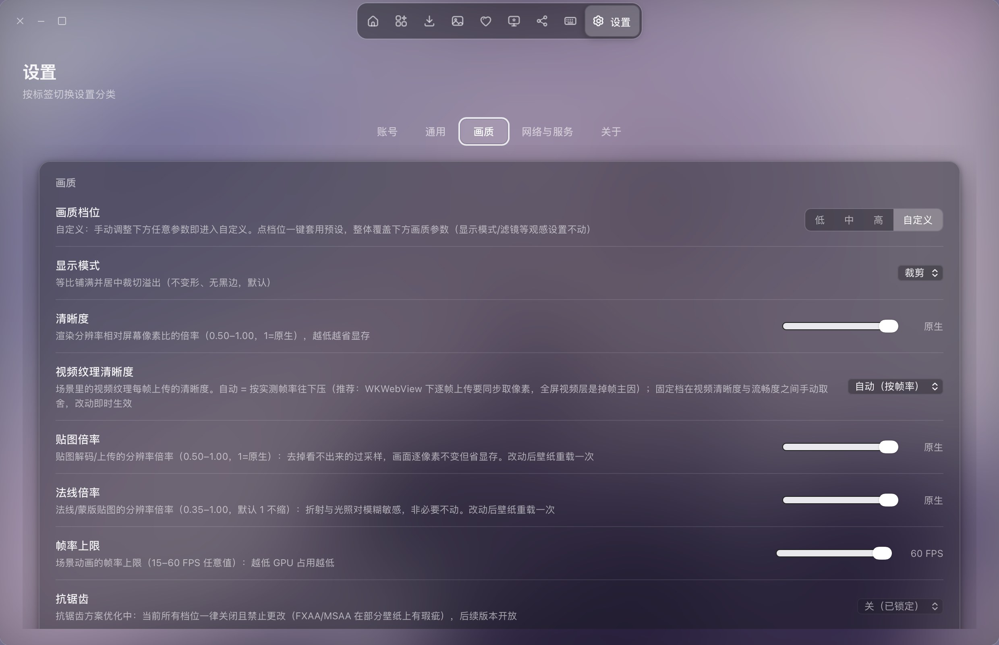
</p>
<p align="center"><sub>设置 · 画质（档位预设 + 清晰度 / 帧率上限等细项）— Quality presets &amp; fine tuning</sub></p>

<p align="center">
  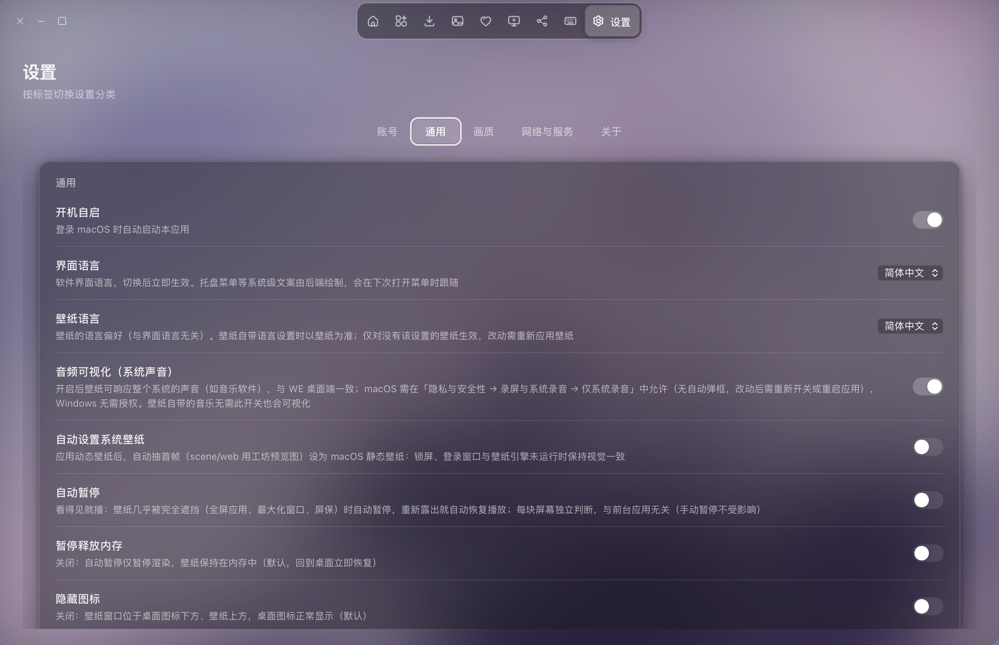
</p>
<p align="center"><sub>设置 · 通用（自启 / 语言 / 音频可视化 / 自动暂停）— General</sub></p>

<p align="center">
  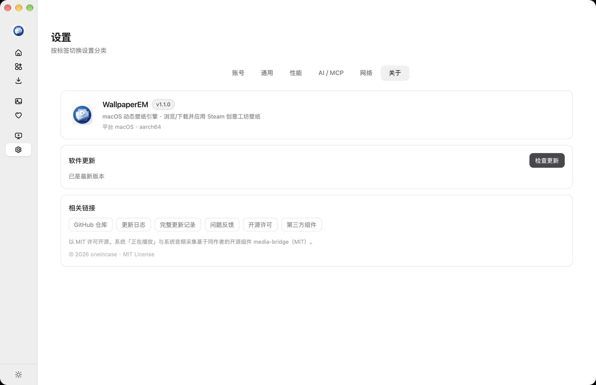
</p>
<p align="center"><sub>设置 · 关于（应用内更新）— About (in-app updates)</sub></p>

<p align="center"><sub>界面为深色玻璃，底色与描边跟随当前壁纸自适应着色；截图为 macOS 真机实拍。</sub></p>
<p align="center"><sub>Dark-glass UI whose tint follows the wallpaper currently applied; captured live on macOS.</sub></p>

---

## 🪄 壁纸引擎魔法 / Wallpaper Engine Magic

**WallpaperEM** = **Wallpaper Engine Magic**。

### 中文

**是什么。** 一个把「Wallpaper Engine 生态」接到你自己桌面上的开源引擎。它复用你的 Steam 账号，
用 Valve 官方的 `steamcmd` 从创意工坊把壁纸**下载**到本地，再用自己的渲染器把
**视频 / GIF / 网页 / 场景（WebGL）/ 图片** 画到桌面最底层 —— 于是你不必常年挂着一个 Steam
客户端，也不被单一平台绑住：Windows / macOS / Linux 上共用同一套本地库。

**「魔法」在哪。** 壁纸窗口不是普通窗口，它是**桌面层级的一个成员**：macOS 上是一扇位于桌面图标
之下的原生桌面层窗口；Windows 上按系统版本挂进 `Progman` / `WorkerW` 桌面层（Win11 的
raised-desktop 与 Win10 的经典结构都做了适配）；Linux 上走 X11 桌面层。桌面图标照常可点、
其他应用照常置顶，而你看到的「桌面背景」已经是一段可以互动的实时画面。

**一张壁纸的一生。**

1. **找到它** —— 「工坊」页搜索 / 排序 / 按类型与题材筛选；本地文件也可以直接导入本地库。
2. **拿回来** —— `steamcmd` 串行下载，支持 Steam Guard 验证码与失败重试；账号密码**本地加密
   存储**，不弹系统钥匙串授权。工坊条目失效后会在本地库中被识别并清理。
3. **渲染它** —— 应用时为每块屏启动一个渲染器页（与媒体同源的内容服务器，消除跨源限制）：
   视频 / GIF 走媒体管线；网页壁纸直接跑它自己的 HTML/JS 并注入 WE 的 shim API；场景壁纸用
   [`webwallgl`](https://github.com/oneincase/webwallgl) 解析 `scene.pkg` 做 WebGL 渲染。
4. **贴到桌面** —— 各平台后端把窗口摆进桌面层，并跟随显示器布局、睡眠唤醒、分辨率与缩放变化。
5. **让它跟着系统走** —— 系统「正在播放」（歌名 / 歌手 / 封面 / 进度）与系统音频频谱实时推送给
   壁纸；切到别的应用自动暂停、回到桌面恢复；还能把代表帧同步为系统静态壁纸，锁屏与引擎未运行时
   观感一致。
6. **让 AI 也来做壁纸** —— 内置 MCP 服务把整条链路（建工程 → 写素材 → 校验 →
   安装 → 应用 → 截图 → 上传工坊）开放给 AI 代理，壁纸工程可以被程序化地创作与迭代。

**定位与边界。** 这是一个**独立的开源项目**，与 Wallpaper Engine 及其开发者、Valve 均无隶属关系；
它不修改也不绕过 WE，创意工坊内容仍来自你自己的 Steam 账号，因此**需要账号拥有《Wallpaper
Engine》**。下载走 Valve 官方工具，同一账号登录 steamcmd 会挤掉正在运行的 Steam 客户端
（steamcmd 固有行为，无法规避）。

**适合谁。** 想在 Windows / macOS / Linux 上用同一套引擎管理壁纸库的人；不想为了动态壁纸常年多开
一个 Steam 客户端的人；以及想用 AI 批量生成、调整场景壁纸的人。想先从源码跑起来，见
[从源码构建](#从源码构建--build-from-source)。

### English

**What it is.** An open-source engine that brings the Wallpaper Engine ecosystem to your own desktop.
It reuses your Steam account to **download** wallpapers from the Workshop with Valve's official
`steamcmd`, then renders them with its own engine — **video / GIF / web / scene (WebGL) / image** —
onto the bottom layer of your desktop. So you don't have to keep a Steam client running all the time,
and you're not tied to a single platform: the same local library serves Windows, macOS and Linux.

**Where the "magic" is.** The wallpaper window is not an ordinary window — it is **a member of the
desktop layer**: a native desktop-level window below the icons on macOS; a `Progman` / `WorkerW`
desktop-layer child on Windows (both the Windows 11 raised-desktop layout and the classic Windows 10
one are handled); an X11 desktop-layer window on Linux. Desktop icons stay clickable, other apps still
sit on top, and what you see as the "desktop background" is a live, interactive scene.

**The life of a wallpaper.**

1. **Find it** — search, sort and filter by type and genre on the Workshop page; local files can be
   imported straight into the library.
2. **Fetch it** — serial downloads through `steamcmd`, with Steam Guard codes and retries;
   credentials are **encrypted locally**, with no Keychain prompt. Entries that disappear from the
   Workshop are detected and cleaned up in the library.
3. **Render it** — applying a wallpaper starts one renderer page per display (served by the same
   content server as the media, which removes cross-origin restrictions): video / GIF go through the
   media pipeline; web wallpapers run their own HTML/JS with the WE shim API injected; scene
   wallpapers are parsed from `scene.pkg` and rendered in WebGL by
   [`webwallgl`](https://github.com/oneincase/webwallgl).
4. **Put it on the desktop** — each platform backend places the window in the desktop layer and keeps
   up with display layout, sleep/wake, resolution and scaling changes.
5. **Let it follow the system** — the system Now Playing data (title / artist / cover / progress) and
   the system audio spectrum are streamed to the wallpaper in real time; rendering pauses when you
   switch to another app and resumes when you return to the desktop; a representative frame can be
   synced as the system static wallpaper so the lock screen matches while the engine isn't running.
6. **Let AI make wallpapers too** — the built-in MCP server opens the whole pipeline (create project →
   write assets → validate → install → apply → screenshot → workshop upload) to AI agents, so
   wallpaper projects can be authored and iterated programmatically.

**Positioning and boundaries.** This is an **independent open-source project**, not affiliated with
Wallpaper Engine, its developers, or Valve. It neither modifies nor bypasses WE: Workshop content still
comes from your own Steam account, so **the account must own *Wallpaper Engine***. Downloads use
Valve's official tool, and signing steamcmd in with the same account disconnects your running Steam
client (inherent to steamcmd, no way around it).

**Who it's for.** People who want a single engine to manage their wallpaper library across
Windows / macOS / Linux; people who'd rather not keep an extra Steam client running just for live
wallpapers; and people who want to generate or tweak scene wallpapers with AI. To run it from source,
see [Build from Source](#从源码构建--build-from-source).

---

## ✨ 功能特性 / Features

### 中文

- 🖼️ **五类壁纸**：视频（mp4/webm/mov）、GIF、网页（HTML/JS）、场景（WE 原生 `scene.pkg`，由 [`webwallgl`](https://github.com/oneincase/webwallgl) WebGL 渲染）、静态图片。
- 🌐 **Steam 创意工坊**：搜索、排序（趋势 / 最多订阅 / 最多收藏 / 最新）、类型与题材筛选、分页浏览。
- ⬇️ **下载**：使用 Valve 官方 **steamcmd**（应用内一键安装），支持 Steam Guard 验证码、串行队列与失败重试；账号密码**本地加密存储**，不弹系统钥匙串授权。
- 🗂️ **本地库与收藏**：预览、应用、打开目录、删除；属性可自定义的壁纸带可视化属性面板（滑块/开关/配色/下拉/文件）。
- 🖥️ **多显示器**：每屏一个桌面级窗口，默认置于桌面图标之下（图标仍可点击）；可开启「交互模式」把壁纸提到图标之上以接收鼠标。
- 🎞️ **轮播播放列表**：按间隔在本地库壁纸间自动切换。
- 🎚️ **性能可调**：**帧率上限 24 / 30 / 45 / 60 / 120（默认 24）**；**清晰度 省电 / 标准 / 高清（默认高清）**；可对单张壁纸单独覆盖。
- 🎛️ **滤镜效果**：高斯模糊 / 黑白 / 怀旧 / 鲜艳 / 暖色 / 冷色 / 反色 / 提亮 / 压暗 / 高对比。
- 🔊 **系统音频可视化**：捕获系统输出做实时 FFT，壁纸跟着音乐律动（macOS 需屏幕录制权限，Windows 免权限）。
- 🎵 **系统「正在播放」**：歌名 / 歌手 / 专辑 / 进度 / 封面推送给壁纸（macOS MediaRemote、Windows GSMTC、Linux MPRIS）。
- ⏸️ **自动暂停（看得见就播）**：壁纸几乎被完全遮挡（全屏应用 / 最大化窗口 / 屏保）时自动暂停，重新露出即恢复；每块屏幕独立判断，与前台应用无关（省电，可开关）。
- 🖼️ **系统静态壁纸同步**：把当前壁纸的代表帧设为系统静态壁纸，锁屏 / 引擎未运行时观感一致。
- 🔔 **托盘 + 自定义全局快捷键**：主界面 / 壁纸设置 / 暂停播放 / 自动暂停 / 定时切换 / 上一张 / 下一张共 7 组全局热键，逐项可录制改键、可恢复默认；托盘内可切显示模式、清晰度、帧率、滤镜。
- 🌍 **界面语言**：中文 / English 一键切换（界面、托盘菜单、原生文案、后端提示一起变）。
- 📡 **壁纸分享**：生成分享链接（永久 / 限时，直链 / iframe 代码），手机等设备用浏览器打开即**实时渲染**该壁纸（支持竖屏 / 横屏切换、局域网二维码）；网络模式可选本机 / 局域网 / 任意。
- 🔄 **应用内更新**：设置 → 关于 里「检查 → 下载 → 安装 → 重启生效」，更新产物带签名校验。
- 🤖 **AI / MCP 创作**：内置 MCP 服务（默认 `127.0.0.1:7411`），30+ 工具覆盖「建工程 → 写素材 → 校验 → 安装 → 应用 → 截图 → 上传工坊」全流程（详见 [MCP 服务](#mcp-服务--mcp-server)）。
- 🧹 **首次安装不打扰**：从未应用过壁纸时不创建任何壁纸窗口，桌面保持系统壁纸；壁纸缺失/加载失败时只显示简洁的 SVG 提示。
- 🧱 **原生集成**：macOS 桌面层窗口、Linux X11 桌面层、Windows `Progman` / `WorkerW` 桌面层（含 Win11 raised-desktop 适配），全部无边框透明、系统级置底。

### English

- 🖼️ **Five wallpaper types**: video (mp4/webm/mov), GIF, web (HTML/JS), scene (native WE `scene.pkg`, rendered in WebGL by [`webwallgl`](https://github.com/oneincase/webwallgl)), and static images.
- 🌐 **Steam Workshop**: search, sort (Trend / Most Subscribed / Most Favorited / Newest), type & genre filters, paginated browsing.
- ⬇️ **Downloads**: Valve's official **steamcmd** (installed from inside the app), with Steam Guard codes, a serial queue and retries; credentials are **encrypted locally** — no Keychain auth prompt.
- 🗂️ **Local library & favorites**: preview, apply, open folder, delete; wallpapers with customizable properties get a visual property panel (slider / toggle / color / combo / file).
- 🖥️ **Multi-display**: one desktop-level window per screen, sitting below the desktop icons by default (icons stay clickable); an optional "interactive" mode raises it above the icons to receive mouse input.
- 🎞️ **Playlist rotation**: automatically cycle through local-library wallpapers on a timer.
- 🎚️ **Tunable performance**: **frame-rate cap 24 / 30 / 45 / 60 / 120 (default 24)**; **quality 省电 / 标准 / 高清 (default High)**; both can be overridden per wallpaper.
- 🎛️ **Filters**: Gaussian blur / monochrome / sepia / vivid / warm / cool / invert / brighten / darken / high contrast.
- 🔊 **System audio visualisation**: real-time FFT of the system output, so wallpapers react to your music (Screen Recording permission on macOS; none needed on Windows).
- 🎵 **System Now Playing**: title / artist / album / progress / cover art delivered to wallpapers (MediaRemote on macOS, GSMTC on Windows, MPRIS on Linux).
- ⏸️ **Auto-pause (visible = playing)**: pauses when the wallpaper is almost fully occluded (full-screen app / maximised window / screen saver) and resumes the moment it reappears; judged per screen and independent of the foreground app (toggleable).
- 🖼️ **System static wallpaper sync**: use a representative frame of the current wallpaper as the system wallpaper, so the lock screen and the engine-off state look consistent.
- 🔔 **Tray + rebindable global shortcuts**: seven global hotkeys (main window / wallpaper settings / pause / auto-pause / rotation / next / previous), each one rebindable and resettable from the app; display mode, quality, frame rate and filter are switchable from the tray.
- 🌍 **UI language**: one-click switch between 中文 and English (UI, tray menu, native strings and backend messages all follow).
- 📡 **Wallpaper sharing**: generate a share link (permanent or time-limited, direct link / iframe code); open it in any browser — e.g. on your phone — and the wallpaper **renders live** there (portrait / landscape toggle, LAN QR code included). Network modes: local-only / LAN / any.
- 🔄 **In-app updates**: check → download → install → restart from Settings → About, with signature-verified update artifacts.
- 🤖 **AI / MCP authoring**: a built-in MCP server (default `127.0.0.1:7411`) exposes 30+ tools covering "create project → write assets → validate → install → apply → screenshot → workshop upload" (see [MCP Server](#mcp-服务--mcp-server)).
- 🧹 **Non-intrusive first run**: no wallpaper window is created until you apply one, so the desktop keeps your system wallpaper; when a wallpaper is missing or fails to load, only a minimal SVG notice is shown.
- 🧱 **Native integration**: macOS desktop-level windows, the Linux X11 desktop layer, and the Windows `Progman` / `WorkerW` desktop layer (including the Windows 11 raised-desktop layout) — all borderless, transparent and system-level.

---

## 🛠️ 技术栈 / Tech Stack

| 层 / Layer | 技术 / Tech |
| --- | --- |
| 前端 / Frontend | React 19 · TypeScript · Vite 6 · Tailwind CSS 4 |
| 桌面壳 / Shell | Tauri 2 · Rust |
| 壁纸渲染 / Renderer | WKWebView / WebView2 / WebKitGTK 渲染页 + [`webwallgl`](https://github.com/oneincase/webwallgl)（WebGL 场景渲染器） |
| 存储 / Storage | SQLite（rusqlite）· 本地加密凭据 |
| 下载 / Download | steamcmd（Valve 官方，运行时安装）· 串行队列 + Steam Guard |
| 媒体 / Media | ffmpeg（抽帧，可选）· [media-bridge](https://github.com/oneincase/media-bridge)（正在播放 / 封面 / 控制 / 音频频谱，三平台统一，进程内依赖） |
| 扩展 / Extension | 内置 MCP 服务（axum，JSON-RPC over HTTP） |

| 平台 / Platform | 桌面层 / Desktop layer | 正在播放 / Now Playing | 音频频谱 / Audio spectrum |
| --- | --- | --- | --- |
| macOS 13+ | 原生桌面层窗口（图标之下 / 之上两档） | MediaRemote（15.4+ 经内嵌 helper + `/usr/bin/perl` 权限通道） | CoreAudio 进程 Tap（需「系统音频录制」授权） |
| Linux（X11，x64 / ARM64） | X11 桌面层窗口 | MPRIS（D-Bus） | PulseAudio / PipeWire monitor（`parec` / `pw-record` 自动探测） |
| Windows 10/11（x64 / ARM64） | `Progman` / `WorkerW` 桌面层（含 Win11 raised-desktop 适配）/ Z 序置底 | GSMTC（`Windows.Media.Control`） | WASAPI loopback（免权限） |

---

## 🚀 从源码构建 / Build from Source

### 环境要求 / Prerequisites

**通用 / Common**

- **Node.js 20+ 与 pnpm**
- **Rust toolchain**（rustup）

**macOS**

- **macOS 13+**（Apple Silicon / Intel 通用包，universal binary）
- **Xcode Command Line Tools**
- 仅本地构建 Intel 切片时需要 `rustup target add x86_64-apple-darwin`（发布包由 CI 出 universal）

**Linux**（**Ubuntu 22.04 及以上** / glibc 2.35+ —— 发布包即按此基线构建，Debian 12+
等同代发行版同样可用；主路径：X11 会话 + GNOME / KDE / Cinnamon / MATE / XFCE；
x64 / ARM64 均可，arm64 需在 arm64 机器或 arm64 容器里构建以免交叉编译缺 sysroot）

```bash
# Debian / Ubuntu 示例
sudo apt install libwebkit2gtk-4.1-dev build-essential curl wget file \
  libxdo-dev libssl-dev libayatana-appindicator3-dev librsvg2-dev libdbus-1-dev
```

- 可选 **ffmpeg**（系统静态壁纸抽帧；应用内也可一键安装）。
- 下载功能需要 **32 位 multilib**（steamcmd 官方 Linux 引导程序是 32 位）：
  `sudo dpkg --add-architecture i386 && sudo apt install libc6:i386 libstdc++6:i386`。
  应用内安装 steamcmd 时会自动检测并提示。

**Windows 10/11（x64 / ARM64）**

- **Visual Studio Build Tools**（MSVC + Windows SDK）
- **WebView2 Runtime**（Win11 自带；Win10 安装包会自动带上引导器）
- 本地出 ARM64 包同样是**交叉编译**（x64 机器即可）：`rustup target add aarch64-pc-windows-msvc`，
  并在 VS 的「ARM64 生成工具」环境下构建（CI 用 `ilammy/msvc-dev-cmd` arch=arm64 切换）

### 安装依赖 / Install dependencies

WallpaperEM 依赖两个同作者的自维护仓库，都以**仓库平级目录**的形式接入（即克隆到
WallpaperEM 旁边），缺一个就装不上 / 编译不过：

```bash
git clone https://github.com/oneincase/webwallgl.git     # 渲染库（file: 依赖）
git clone https://github.com/oneincase/media-bridge.git  # 媒体桥接（Cargo path 依赖）
git clone https://github.com/oneincase/WallpaperEM.git
cd WallpaperEM
pnpm install
```

- `webwallgl` 需**先构建出库产物**（前端依赖 `file:../webwallgl-github/dist/lib`，
  注意目录名是 `webwallgl-github`，克隆后请保持或改 `package.json` 里的路径）：

  ```bash
  cd ../webwallgl && pnpm install && pnpm run build:lib
  ```

- `media-bridge` 无需构建，但必须与 WallpaperEM 平级（`src-tauri/Cargo.toml` 里是
  `path = "../../media-bridge/crates/media-bridge"`）。

### 开发运行 / Run in development

```bash
pnpm tauri dev
```

### 打包 / Build a release

```bash
pnpm tauri build
```

> ⚠️ 应用内更新签名校验（`bundle.createUpdaterArtifacts`）要求提供更新签名私钥，
> 本地打包前先设置（CI 里由仓库 Secret `TAURI_SIGNING_PRIVATE_KEY` 自动注入；
> 忘记设置会在打包阶段明确报错）：
>
> ```bash
> export TAURI_SIGNING_PRIVATE_KEY="$HOME/.tauri/wallpaperem.key"   # 密钥文件路径（或直接粘贴文件内容）
> export TAURI_SIGNING_PRIVATE_KEY_PASSWORD=""                      # 该密钥无密码
> ```
>
> 只跑 `pnpm tauri dev` 不需要该密钥。

> 产物 / Bundles：
> - macOS：`bundle/dmg/*.dmg`、`bundle/macos/WallpaperEM.app`
>   - **universal（Intel + Apple Silicon）**：加 `--target universal-apple-darwin`，产物在
>     `src-tauri/target/universal-apple-darwin/release/bundle/` 下；CI 默认出这个
> - Linux：`bundle/deb/*.deb`、`bundle/appimage/*.AppImage`
>   - ARM64：加 `--target aarch64-unknown-linux-gnu`，产物在 `src-tauri/target/aarch64-unknown-linux-gnu/release/bundle/` 下
>     （CI 用原生 `ubuntu-22.04-arm` runner，不做交叉编译）
>   - x64 / arm64 都用 **22.04 底座**构建（glibc 2.35），产物在 **Ubuntu 22.04 及以上**可直接安装
> - Windows：`bundle/nsis/*.exe`、`bundle/msi/*.msi`
>   - ARM64：加 `--target aarch64-pc-windows-msvc`，产物在 `src-tauri/target/aarch64-pc-windows-msvc/release/bundle/` 下
>   - 见 `.github/workflows/build-windows.yml`（x64 / arm64 矩阵）

> **关于 steamcmd / About steamcmd**
> 下载工坊内容使用 Valve 官方 steamcmd，首次在「设置 → 账号」点「安装」即可（约 2.5 MB 引导包，初始化后约 85 MB，装在应用数据目录，不随安装包分发）。
> 其官方引导程序是 x86_64，Apple Silicon 上**首次启动需要 Rosetta 2**（`softwareupdate --install-rosetta --agree-to-license`），自更新后即以原生 arm64 运行。
>
> Workshop downloads use Valve's official steamcmd, installed once from Settings → Account (a ~2.5 MB bootstrap; ~85 MB after init; kept in the app data directory, not bundled).
> Its bootstrap is x86_64, so the **first launch on Apple Silicon needs Rosetta 2**; it self-updates to a native arm64 build afterwards.

> **macOS 签名与录屏授权 / macOS code signing & Screen Recording permission**
>
> macOS 的 TCC 权限（录屏、辅助功能等）绑定在应用签名上。**ad-hoc 签名（默认）每次构建
> 签名都不同**——每装一个新包都要重新授权录屏。解决：固定一把自签名证书（无需 Apple
> 开发者账号）：

---

## 🐧 平台说明 / Platform Notes

### macOS

- 壁纸窗口默认位于**桌面图标之下**（图标可点击）—— 鼠标事件由宿主轮询并注入，因此视差/网页交互仍然有效。
- 开启「壁纸交互（图标上方）」后壁纸会盖住桌面图标以直接接收鼠标。
- 系统音频可视化需要**屏幕录制**权限；「正在播放」依赖私有框架 MediaRemote（借 Apple 签名进程加载 adapter，无需额外授权）。

### Linux

- 主路径是 **X11**。Wayland 下壁纸窗口退化为「置底 + 全工作区」的普通无边框窗口；**GNOME Wayland 不支持桌面层窗口**（上游协议限制），建议使用 X11 会话。
- 相较 macOS：**系统音频可视化暂未接入**（待 PipeWire）；**自动暂停**尚未实现；指针注入不可用。
- **托盘**：GNOME 需要 AppIndicator 扩展（如 `gnome-shell-extension-appindicator`）；KDE / Cinnamon / XFCE 自带。
- **视频编解码（必装）**：WebKitGTK 的音视频播放依赖系统 GStreamer 插件，缺失会**黑屏/无声**（日志出现 `GStreamer element appsink/autoaudiosink not found`）。deb 包已声明依赖自动安装；AppImage 需手动装：

  ```bash
  # Debian / Ubuntu
  sudo apt install gstreamer1.0-plugins-base gstreamer1.0-plugins-good \
      gstreamer1.0-plugins-bad gstreamer1.0-libav
  # Fedora
  sudo dnf install gstreamer1-plugins-base gstreamer1-plugins-good \
      gstreamer1-plugins-bad-free gstreamer1-libav
  # Arch
  sudo pacman -S gst-plugins-base gst-plugins-good gst-plugins-bad gst-libav
  ```

  启动时会自动体检关键 element，缺什么会给出对应安装命令。

### Windows

- 桌面层不依赖第三方插件，而是自行父子化并用 `GetParent` 校验：Win11 的 raised-desktop 结构（`Progman` 带 `WS_EX_NOREDIRECTIONBITMAP`）下按微软给第三方壁纸程序的指引，把壁纸窗口挂成 `Progman` 的子窗口、紧贴 `SHELLDLL_DefView` 之下，并把承载静态壁纸的 `WorkerW` 压到 Z 序最底；Win10 等经典结构仍走「兄弟 `WorkerW`」。「交互模式」下脱离桌面层并压到 Z 序最底、盖住桌面图标。
- 音频可视化走 **WASAPI 共享模式 loopback**（抓默认渲染端点混音），**不需要任何权限**。
- 需要 **WebView2 Runtime**（Win11 自带；ARM64 的 Win11 也预装）。
- 支持 **Windows 10 / 11**，提供 **x64 与 ARM64** 两种安装包。

---

## 📖 使用说明 / Usage

1. **安装下载工具**：打开 设置 → 账号，点「安装」一次性装好 steamcmd。
   *(Install steamcmd once from Settings → Account.)*
2. **登录下载账号**：填入 Steam 账号与密码（需要拥有 Wallpaper Engine）。凭据本地加密存储，不会请求系统钥匙串授权。
   *(Enter your Steam account and password — you must own Wallpaper Engine. Credentials are encrypted locally.)*
3. **浏览工坊**：在「工坊」页搜索、筛选、排序，点「下载」入队。
   *(Browse the Workshop page; search, filter and sort, then queue a download.)*
4. **应用到桌面**：在「本地库」或详情页点「应用到桌面」；多屏会一起生效。
   *(Apply from the Library or the item detail page; all displays follow.)*
5. **调优**：设置 → 通用 可调 **帧率上限** 与 **清晰度**（省电优先就选 24 FPS + 省电）；单张壁纸可在「壁纸设置」里单独覆盖。
   *(Tune frame rate cap and quality under Settings → General; each wallpaper can override them in Wallpaper Settings.)*
6. **托盘与快捷键**：托盘可切显示模式 / 清晰度 / 帧率 / 滤镜；`Cmd/Ctrl+Shift+P` 暂停/恢复，`Cmd/Ctrl+Shift+N` 下一张 —— 这 7 组全局热键都能在「快捷键」页里改键。
   *(Switch display mode / quality / frame rate / filter from the tray; Cmd/Ctrl+Shift+P pauses, Cmd/Ctrl+Shift+N skips — all seven global hotkeys are rebindable on the Shortcuts page.)*
7. **壁纸交互（可选）**：设置 → 通用 → 开启「壁纸交互」后，场景视差与网页壁纸可接收鼠标（会盖住桌面图标）。
   *(Enable "Wallpaper interaction" for scene parallax and web wallpaper mouse input — it covers the desktop icons.)*

---

## 🤖 MCP 服务 / MCP Server

应用内置 MCP（Model Context Protocol）服务，让 AI 客户端（Claude Code / Cursor / Codex CLI 等）直接创作与调试壁纸工程。

The app ships an MCP (Model Context Protocol) server so AI clients (Claude Code, Cursor, Codex CLI, …) can create and debug wallpaper projects directly.

<p align="center">
  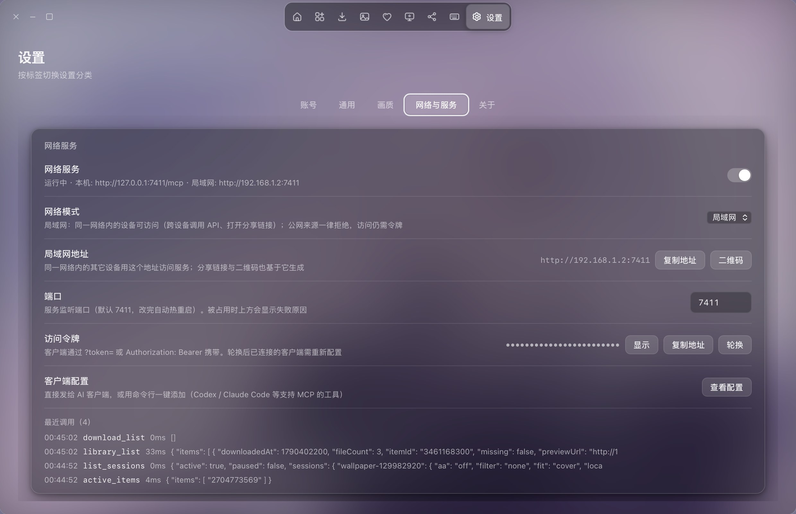
</p>
<p align="center"><sub>设置 · 网络与服务：MCP、REST API 与壁纸分享共用一个网络服务（端口 / 令牌 / 局域网地址与二维码）— MCP, REST API and sharing share one local service</sub></p>

- **开启**：设置 → **网络与服务** → 打开开关；页面会给出端口（默认 `7411`）、令牌与「复制带令牌地址」。
- **接入**：把 `http://127.0.0.1:<port>/mcp?token=<token>` 作为 MCP 服务器地址加入客户端：

```jsonc
// Claude Desktop / Cursor 的 mcpServers 配置
{
  "mcpServers": {
    "wallpaperem": { "url": "http://127.0.0.1:7411/mcp?token=<你的令牌>" }
  }
}
```

- **能力**：项目 CRUD、文件读写、静态校验、`scene` 打包、安装到本地库、应用到桌面、壁纸截图（实拍当前窗口）、属性读写、工坊搜索与下载、**工坊上传**（`workshop_upload` / `workshop_upload_status`，需要 Steam 客户端运行且账号拥有 Wallpaper Engine；版本历史由创作者自行维护，不在 MCP 服务里）等 30+ 工具，另有 resources / prompts。
- **工程位置**：`<系统文稿目录>/WallpaperEM/Projects/<工程名>/`，用户可见可改；MCP 的文件工具只能读写该工作区内的文件。

> 详见 [`docs/mcp-authoring-web.md`](docs/mcp-authoring-web.md)（网页壁纸）与 [`docs/mcp-authoring-scene.md`](docs/mcp-authoring-scene.md)（场景壁纸）。

> See [`docs/mcp-authoring-web.md`](docs/mcp-authoring-web.md) (web wallpapers) and [`docs/mcp-authoring-scene.md`](docs/mcp-authoring-scene.md) (scene wallpapers).

---

## 📁 项目结构 / Project Structure

```
WallpaperEM/
├─ public/icon/                 # 应用图标（含多倍图）
├─ renderer/                    # 壁纸渲染器页（视频 / GIF / 网页 / 场景 / 图片）
├─ src/                         # Tauri 前端主界面（发现 / 工坊 / 下载 / 本地库 / 收藏 / 显示器 / 分享 / 快捷键 / 设置）
│  ├─ locales/                  # 中→英文案表（中文原文当键）
│  └─ lib/i18n.ts               # 运行时取词（tr / trMsg / useLocale）
├─ docs/
│  ├─ mcp-authoring-web.md      # 网页壁纸工程规范（面向 AI agent）
│  ├─ mcp-authoring-scene.md    # 场景壁纸工程规范（面向 AI agent）
│  ├─ cross-platform-research.md
│  └─ img/                      # 界面截图（shot-*.jpg）与赞助码
├─ src-tauri/
│  ├─ src/
│  │  ├─ wallpaper/             # 壁纸引擎：多屏桌面窗口 / 会话持久化 / 轮播 / 指针注入
│  │  │  ├─ macos.rs · linux.rs · windows.rs   # 各平台桌面层实现
│  │  │  └─ pointer.rs          # 外部指针轮询注入
│  │  ├─ content_server.rs      # 本地内容服务器（渲染器 / 媒体 / 属性 / SSE）
│  │  ├─ media_bridge.rs        # 全平台媒体桥接单例（进程内依赖 ../media-bridge）
│  │  ├─ audio_capture.rs       # 系统音频门面：相位机 + AGC 后处理（三平台采集在 media-bridge）
│  │  ├─ now_playing.rs         # 正在播放门面：快照映射 / 封面 data URL / 控制转发
│  │  ├─ download/              # steamcmd 下载引擎（队列 / Guard / 安装）
│  │  ├─ mcp/                   # 内置 MCP 服务（tools / resources / prompts）
│  │  ├─ steam/                 # Steam 客户端：工坊浏览 / 详情 / 类型
│  │  ├─ library.rs             # 本地库
│  │  ├─ we_props.rs            # WE 用户属性解析与下发
│  │  ├─ we_shim.js             # WE 网页壁纸兼容 shim（注入壁纸 HTML）
│  │  ├─ system_wallpaper.rs    # 系统静态壁纸同步
│  │  ├─ db.rs · secure_store.rs# SQLite / 本地加密凭据
│  │  └─ i18n.rs                # 原生文案（托盘 / 窗口标题）
│  └─ tauri.conf.json
├─ scripts/                     # 构建 / 同步 / 校验 / 抓图脚本
│  └─ ui-shots/                 # README 界面截图：按窗口 2x 抓拍（用法见该目录 README）
├─ CHANGELOG.md · LICENSE
└─ package.json
```

---

## ⚠️ 注意事项 / Notes

- **Wallpaper Engine 授权**：下载工坊内容需要你的 Steam 账号拥有《Wallpaper Engine》。
  *(Downloading workshop content requires owning *Wallpaper Engine* on your Steam account.)*
- **steamcmd 会挤掉 Steam 客户端**：同一账号在 Steam 图形客户端与 steamcmd 中同时只能登录一处，下载时会断开你正在运行的 Steam 客户端（steamcmd 固有行为，无法规避）。
  *(An account can only be signed in once across the GUI client and steamcmd — downloading will disconnect your running Steam client. This is inherent to steamcmd.)*
- **steamcmd 无下载百分比**：`workshop_download_item` 期间不输出进度，应用用「已下载体积 ÷ 条目总大小」估算；总大小未知时显示不确定进度条。
  *(steamcmd emits no progress during `workshop_download_item`; the app estimates it from on-disk size and falls back to an indeterminate bar.)*
- **macOS 交互局限**：默认壁纸在图标之下以保证图标可点；交互模式会盖住图标，且受 macOS 桌面窗口机制限制，体验有限。
  *(On macOS the wallpaper sits below the icons so they stay clickable; interactive mode covers them and remains limited by macOS desktop-window handling.)*
- **地区 / 网络**：访问 Steam 受限时，请在 设置 → 网络 配置代理。
  *(Behind a restricted network, configure a proxy under Settings → Network.)*

---

## 💖 赞助 / Sponsor

如果 WallpaperEM 对你有帮助，欢迎请作者喝杯咖啡 —— 你的支持会让它持续更新。

If WallpaperEM is useful to you, consider buying the author a coffee — your support keeps it going.

<p align="center">
  
  &nbsp;&nbsp;&nbsp;
  
</p>

<p align="center">
  <sub>支付宝 / Alipay &nbsp;·&nbsp; 微信 / WeChat</sub>
</p>

---

## 📄 许可 / License

本项目以 **MIT** 许可证开源，详见 [LICENSE](LICENSE)。

This project is released under the **MIT** license — see [LICENSE](LICENSE).

系统「正在播放」与系统音频采集基于同作者的开源组件
[media-bridge](https://github.com/oneincase/media-bridge)（MIT，以 file 依赖形式接入，
构建时自动内嵌其 macOS 权限通道 helper，无需随包分发额外文件）。

System Now Playing and system audio capture are built on
[media-bridge](https://github.com/oneincase/media-bridge) (MIT) by the same author. It is
integrated as a file dependency; its macOS permission-channel helper is embedded at build
time, so no extra files are shipped.

---

## 🙏 致谢 / Acknowledgements

- [Tauri](https://tauri.app/) · [React](https://react.dev/) · [Vite](https://vite.dev/) · [Tailwind CSS](https://tailwindcss.com/)
- [webwallgl](https://github.com/oneincase/webwallgl) —— WE 场景壁纸的 WebGL 渲染库
- [media-bridge](https://github.com/oneincase/media-bridge) —— 全平台系统媒体桥接（正在播放 / 封面 / 控制 / 音频频谱）
- [SteamCMD](https://developer.valvesoftware.com/wiki/SteamCMD)（Valve）与 [Steam 创意工坊](https://steamcommunity.com/workshop/)
- [Wallpaper Engine](https://www.wallpaperengine.io/) 及其壁纸作者

---

*用 ❤️ 和 Rust 构建 — Built with ❤️ and Rust.*
